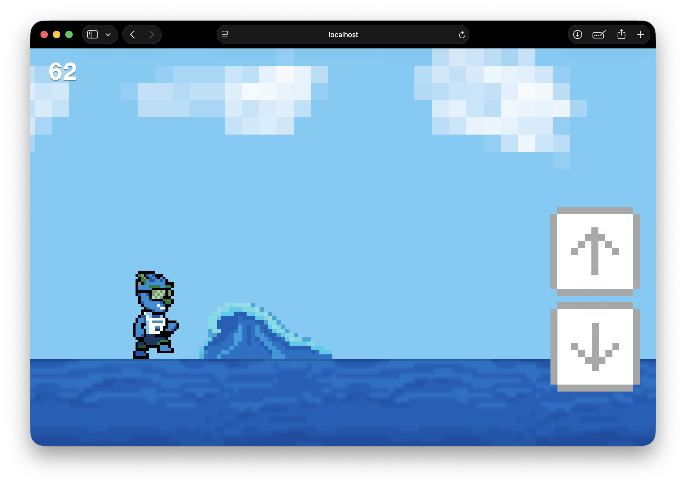
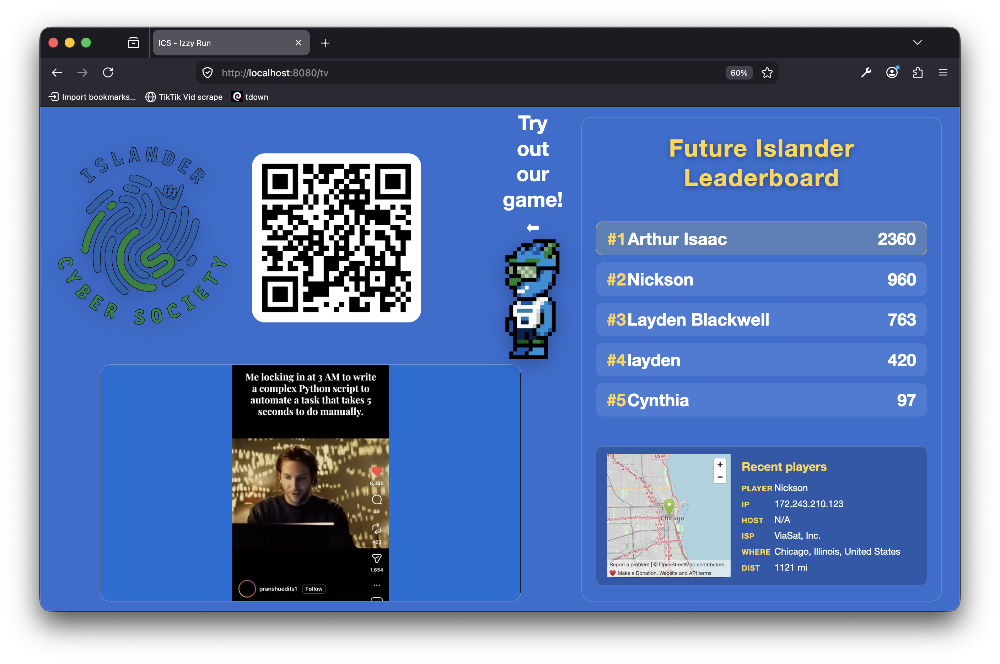

# ICS-orientation-izzyRun




## Compile & run site on localhost:8080
If you want to deploy on a server, add a .env and assign it a `PORT=` for routing, otherwise do not enter a port as it defualts 8080.
```bash
go run main.go
```

## Start Cloudflare tunnel
- Follow Cloudflare's guide on installing a tunnel
- Create .env with `TUNNEL_TOKEN=`


```bash
set -a
source ./.env
set +a
cloudflared tunnel run
```

The two pages should be accessible at `/tv` and `/game` respectively. The QR on the tv page in `assets/img/gameQR.png` is 
wired to https://laydenb.com/ics/game. On arrival the page checks if the duplicate site over at https://ics.laydenb.com/game is 
running and if not it will redirect to that page. This is the system used to keep games running on the RPi demo but have
a permanent page as well.


# AI player
The AI portion of the demo is in DQN AI.  Model is saved to checkpoint.pt and the commands below and for running and training.
There are two scrips to for interfaceing with the model, `train.py` and `play_prod.py` each of the scripts require 
the `--url` flag to specify the url of the game. `train.py` adjusts weights to try and impove which is why the backup 
exists while `play_prod.py` does not make any adjustments. If you want to demo the model while running `train.py` you 
will need to pass the `--show` flag, otherwise you can pass `--num-envs 10` to train on 10 games simultaneously. I
believe that training this model with the intent to improve it will require adjusting parameters, that being said,
it makes for a great demo either way.  

## Install reqs
```bash
cd DQN_AI
python3 -m venv .venv
source .venv/bin/activate
pip install torch playwright numpy matplotlib
playwright install chromium
```

## Run AI player (to be executed from the project root)
```bash
python3 "DQN AI/play_prod.py" --url https://ics.laydenb.com/game
```

### Train on site --show (my preferred demo)
```bash
python3 "DQN AI/train.py" --url https://ics.laydenb.com/game --show
```

### Train on localhost --show
```bash
python3 "DQN AI/train.py" --url http://localhost:8080/game --show
```