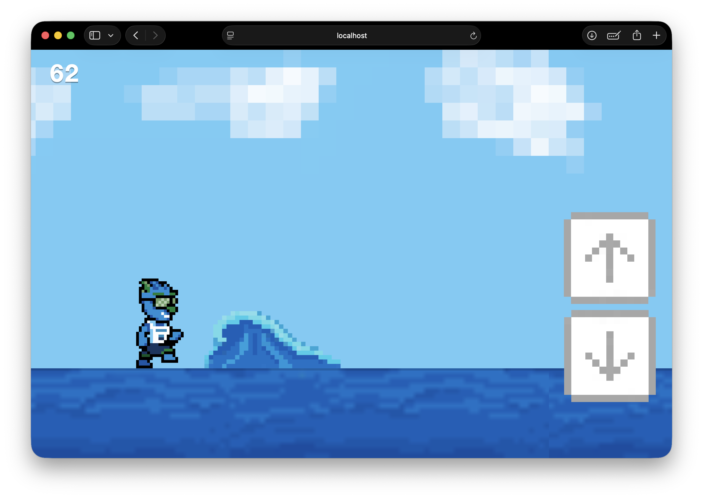
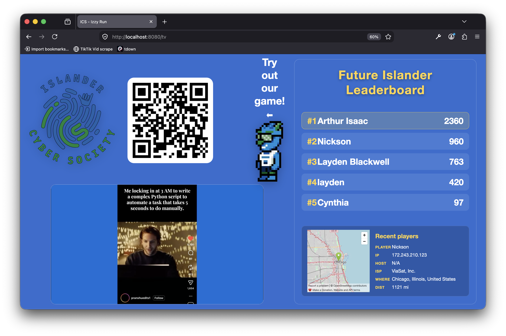

# ICS-orientation-izzyRun
### [Play the game here](https://laydenb.com/ics/izzy-game) or [take a look at the leaderboard](https://laydenb.com/ics/izzy-game/tv) 




## Compile & run site on localhost:8080
```bash
go run main.go
```

Pass `-port` to listen somewhere else (defaults to 8080):
```bash
go run main.go -port 5003
```

Scores live in a SQLite database at `db/scores.db`, created on first run. If a legacy `db/scores.csv` is
present and the database is empty, its rows are imported once on startup so an existing leaderboard carries
over; the CSV itself is left on disk untouched.

## Start Cloudflare tunnel
- Follow Cloudflare's guide on installing a tunnel
- Create .env with `TUNNEL_TOKEN=`


```bash
set -a
source ./.env
set +a
cloudflared tunnel run
```

The game is served at the site root `/` and the TV dashboard at `/tv`. `/game` redirects to `/` so the printed
QR code in `assets/img/gameQR.png`, which is wired to https://laydenb.com/ics/game, keeps working.

Both pages use same-origin relative URLs, so the site can be served from any host or interface — localhost, a
LAN address for phones on the venue wifi, or through the tunnel. The TV dashboard's "recent players" panel
geolocates each player through ip-api. Players reaching the site over the local network have private IPs that
ip-api can't resolve, so those fall back to the server's own public IP: the panel shows the venue's location
(labelled "local network") instead of going blank.


# AI player
The AI portion of the demo is in DQN AI.  Model is saved to checkpoint.pt and the commands below and for running and training.
There are two scrips to for interfaceing with the model, `train.py` and `play_prod.py` each of the scripts require 
the `--url` flag to specify the url of the game. `train.py` adjusts weights to try and impove which is why the backup 
exists while `play_prod.py` does not make any adjustments. If you want to demo the model while running `train.py` you 
will need to pass the `--show` flag, otherwise you can pass `--num-envs 10` to train on 10 games simultaneously. I
believe that training this model with the intent to improve it will require adjusting parameters, that being said,
it makes for a great demo either way.  

## Install reqs
```bash
cd DQN_AI
python3 -m venv .venv
source .venv/bin/activate
pip install torch playwright numpy matplotlib
playwright install chromium
```

## Run AI player (to be executed from the project root)
```bash
python3 "DQN AI/play_prod.py" --url https://ics.laydenb.com/
```

### Train on site --show (my preferred demo)
```bash
python3 "DQN AI/train.py" --url https://ics.laydenb.com/ --show
```

### Train on localhost --show
```bash
python3 "DQN AI/train.py" --url http://localhost:8080/ --show
```